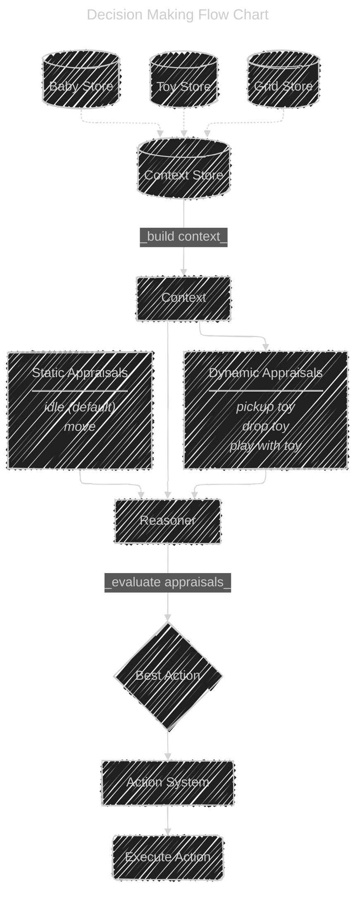

## Baby Simulator

Baby Simulator is a drag and drop web game in which the player is tasked with keeping a baby entertained for as long as possible. Stave off boredom and prevent baby from crying by offering toys. Baby gets tired of toys quickly, so be sure to use a variety of toys with unique properties!

### Decision Making System

Baby Simulator's decision-making system is based on utility theory using a `Reasoner` which evaluates every possible `Action` before making a decision. Decisions are represented by `Appraisals`, which reference a specific `Action` and can have multiple `Considerations`.

For example, when baby _appraises_ the value of picking up a particular toy, baby will _consider_ several factors:
 - How far away is the toy from baby?
 - How appealing is the toy?
 - Is baby bored of similar toys?
 - Has the toy been interacted with recently?

When a decision is made, every possible action is appraised and given a score. The action with the highest score is selected as the decision.

### How to play

Drag toys from the toy box onto the play mat to put them in play. Baby will move toward and pick up the most interesting toy.

_[see below](#decision-making-system) for more information on the decision making system_ 

Prevent boredom from reaching 100% by dragging new toys as baby gets bored of toys that have already been played with.

#### How it works

While baby plays with a toy, `boredom` will decrease while `aversion` increases for each property of the toy. Toys that contain properties that baby has built up `aversion` to satisfy less boredom. 

For example, if baby is playing with a toy that is `red` and its shape is `circle`, baby will build aversion to toys that have `red` colors and/or `circle` shapes.

#### Modes 

__Simulation Mode:__ This is the core version, featuring a minimal UI and a more intuitive approach. Eventually, visual queues will be expressed through baby.

__Detailed Mode:__ This version is primarily used for development and testing to see details about the decisions being made, including the babies aversions, preferences, and preferred toy.

### Options

Using the query parameter "endless=true" will prevent the game over screen and allow the simulation to continue even when boredom is maxed out.