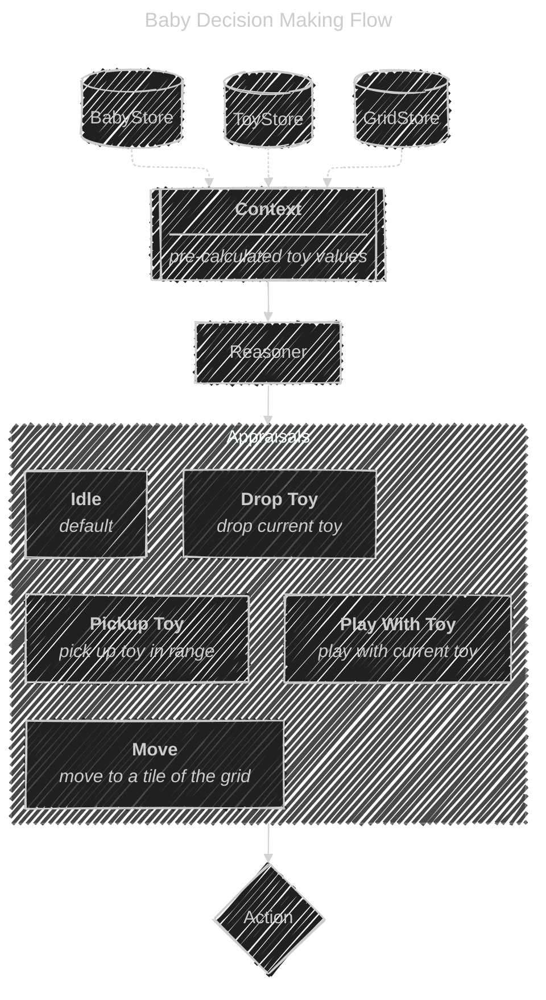

```mermaid
---
title: Baby Decision Making Flow
config:
  layout: elk
  look: handDrawn
  theme: dark
---
flowchart TD

  %% Full FlowChart

  BS -.-> Context
  TS -.-> Context
  GS -.-> Context
  Context --> Reasoner

  Reasoner --> Appraisals --> Action

  subgraph Appraisals
    direction LR
    IA
    MA
    PA
    PTA
    DTA
  end

  %% Definitions

  BS[(BabyStore)]
  TS[(ToyStore)]
  GS[(GridStore)]

  IA["`
    __Idle__
    _default_
  `"]
  MA["`
    __Move__
    _move to a tile of the grid_
  `"]
  PA["`
    __Play With Toy__
    _play with current toy_
  `"]
  PTA["`
    __Pickup Toy__
    _pick up toy in range_
  `"]
  DTA["`
    __Drop Toy__
    _drop current toy_
  `"]

  Action@{ shape: diam, label: Action }

  Context@{ shape: subproc, label: "__Context__
  <hr /> *pre-calculated toy values*" }

  %% Links
  click BS "https://github.com/WestonVincze/baby-simulator/blob/master/src/stores/BabyStore.ts"
  click TS "https://github.com/WestonVincze/baby-simulator/blob/master/src/stores/ToyStore.ts"
  click GS "https://github.com/WestonVincze/baby-simulator/blob/master/src/stores/GridStore.ts"

```
