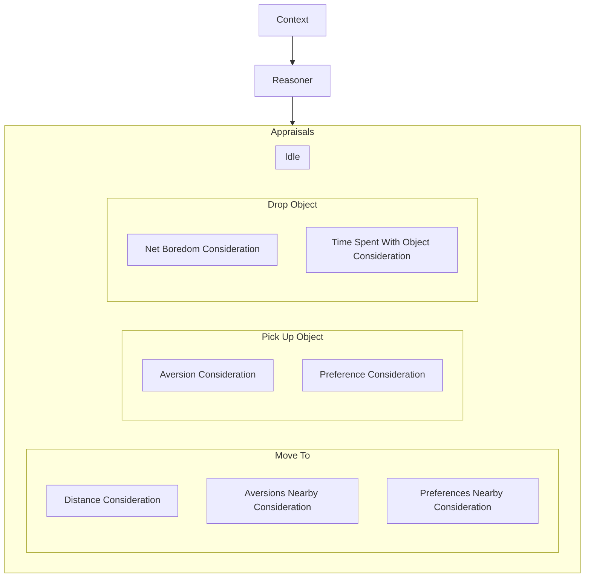

```mermaid
flowchart TD

  subgraph M[Move To]
    DC[Distance Consideration]
    ANC[Aversions Nearby Consideration]
    PNC[Preferences Nearby Consideration]
  end

  subgraph P[Pick Up Object]
    AC[Aversion Consideration]
    PC[Preference Consideration]
  end

  subgraph D[Drop Object]
    NBC[Net Boredom Consideration]
    T[Time Spent With Object Consideration]
  end

  subgraph I[Idle]
  end

  subgraph Appraisals
    M
    P
    D
    I
  end

  C[Context] --> R[Reasoner]
  R --> Appraisals
```
