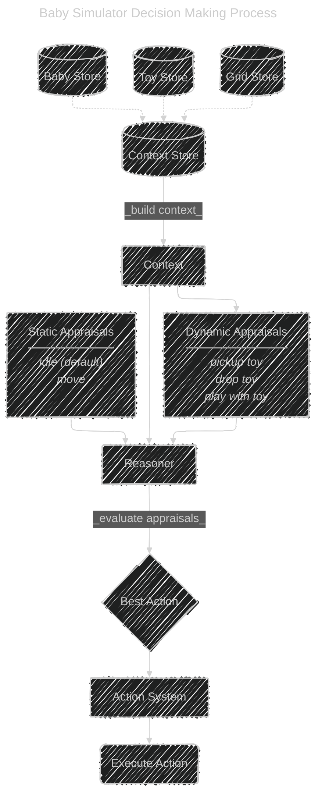

```mermaid
---
title: Baby Simulator Decision Making Process
config:
  layout: elk
  look: handDrawn
  theme: dark
---

flowchart TD
  BS[(Baby Store)]
  TS[(Toy Store)]
  GS[(Grid Store)]
  CS[(Context Store)]

  C[Context]
  %%C["`Context
    %%<hr />_pre-calculated toy values_
  %%`"]

  SA["`Static Appraisals
    <hr /> _idle (default)_
    _move_
    <br />
  `"]

  DA["`Dynamic Appraisals
    <hr />_pickup toy_
    _drop toy_
    _play with toy_
  `"]

  R[Reasoner]

  Action@{ shape: diam, label: Best Action }
  AS[Action System]
  EA@{ shape: rounded, label: Execute Action }

  %% Final Flow
  BS & TS & GS -.-> CS -->|_build context_| C
  DA --> R
  C --> DA
  C --> R
  SA --> R
  R -->|_evaluate appraisals_| Action --> AS --> EA

```